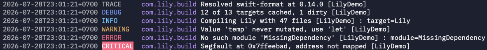

# Lily

> _"Make your log line yours. Just let it compose."_

<p align="left">
<a href="https://swift.org">
  
</a>
<a href="https://github.com/staciax/lily/actions?query=workflow%3ACI">
  
</a>
<a href="https://swiftpackageindex.com/staciax/lily/documentation">
  
</a>
<a href="https://swiftpackageindex.com/staciax/lily">
  
</a>
<a href="https://github.com/staciax/lily/releases">
  
</a>
</p>

A Swift-based library for composable logging, built on [swift-log](https://github.com/apple/swift-log). It helps you shape how they look, structured exactly the way you want.

### Formatter

A template that defines the shape of a log line — configure it once and it applies to every event.

```swift
let formatter = LogFormatter([
    .timestamp,
    " ",
    .level {
        render, _ in
        render().padding(toLength: 8, withPad: " ", startingAt: 0)
    },
    .when({ !$0.label.isEmpty }, then: [" ", .label]),
    " ",
    .message,
    " ",
    .group(["[", .source, "]"]),
    .when({ $0.event.metadata?.isEmpty == false }, then: [": ", .metadata]),
])

StreamLogHandler.standardOutput(label: label, formatter: formatter)
```

```log
2026-07-29T01:35:23+0700 info     lily Compiling Lily with 47 files [LilyDemo]: target=Lily
2026-07-29T01:35:23+0700 warning  lily Value 'temp' never mutated, use 'let' [LilyDemo]
2026-07-29T01:35:23+0700 error    lily No such module 'MissingDependency' [LilyDemo]: module=MissingDependency
2026-07-29T01:35:23+0700 critical lily Segfault at 0x7ffeebad, address not mapped [LilyDemo]
```

[`LogFormatter.standard`](https://github.com/staciax/lily/blob/main/Sources/Lily/Formatting/LogFormatter.swift#L288-L299) produces output that matches [swift-log](https://github.com/apple/swift-log)'s `StreamLogHandler` default format.

```swift
StreamLogHandler.standardOutput(label: label, formatter: .standard)
```

<details>
<summary>Components — all available log line building blocks</summary>

| Component                    | Description                                            |
| ---------------------------- | ------------------------------------------------------ |
| `.timestamp`                 | The formatted timestamp string prepared by the handler |
| `.level`                     | The log level (e.g. `info`, `warning`, `error`)        |
| `.label`                     | The logger label (e.g. `com.example.MyApp`)            |
| `.message`                   | The log message                                        |
| `.metadata`                  | All metadata key-value pairs                           |
| `.metadata(including:)`      | Only selected metadata keys                            |
| `.metadata(excluding:)`      | All metadata except specified keys                     |
| `.metadata(key:)`            | A single metadata value by key                         |
| `.source`                    | The swift-log event source                             |
| `.file`                      | The call-site file path                                |
| `.function`                  | The call-site function name                            |
| `.line`                      | The call-site line number                              |
| `.literal("...")`            | Static text                                            |
| `.group([...])`              | Child components rendered consecutively                |
| `.joined([...], separator:)` | Non-empty children joined by separator                 |
| `.when(_:then:)`             | Child components rendered only when predicate is true  |

Each component also supports a `formattedBy:` variant for custom formatting closures.

</details>

<details>
<summary>Add color with <a href="https://github.com/onevcat/Rainbow">Rainbow</a></summary>

```swift
import Rainbow

let formatter = LogFormatter([
    .timestamp { render, _ in render().dim },
    " ",
    .level { render, context in
        let level = render().padding(toLength: 8, withPad: " ", startingAt: 0).uppercased()
        return switch context.event.level {
        case .debug:    level.blue
        case .info:     level.cyan
        case .warning:  level.yellow
        case .error:    level.red
        case .critical: level.onRed
        default:        level.dim
        }
    },
    .when(
        { !$0.label.isEmpty },
        then: [
            " ",
            .label { render, context in
                let label = render() // handle color support yourself without Rainbow
                return context.supportsColor ? "\u{1B}[35m\(label)\u{1B}[0m" : label
            },
        ]
    ),
    " ",
    .message,
    " ",
    .group(["[", .source, "]"]),
    " ",
    .when({ $0.event.metadata?.isEmpty == false }, then: [": ", .metadata]),
])

StreamLogHandler.standardOutput(label: label, formatter: formatter)
```



Each component accepts an optional `formattedBy:` closure with access to the rendering context — letting you apply ANSI color, reorder fields, or transform values however you like.

</details>

### Filter

A named predicate in a handler's pipeline — each event either passes through or gets dropped.

```swift
let filter = LogFilter(name: "min-level") { event in
    event.level >= .warning ? event : nil
}

var handler = StreamLogHandler.standardOutput(label: label)
handler.addFilter(filter)
```

Filters run in the order they were added. If any filter returns `nil`, the event is dropped immediately.

`addFilter(_:)` is a no-op and returns `false` if a filter with the same name already exists.

<details>
<summary>Reusable filter structs</summary>

```swift
struct NoiseSuppressor: LogFiltering {
    var name: String { "discord-kit-noise" }

    func filter(_ event: LogEvent) -> LogEvent? {
        guard case .warning = event.level,
              event.source == "DiscordKit",
              event.message.description.contains("referencing an unknown")
        else { return event }
        return nil
    }
}

let handler = StreamLogHandler.standardOutput(
    label: label,
    filters: [NoiseSuppressor()]
)
```

Two approaches — `LogFilter` for quick one-off closures, `LogFiltering` for reusable filter structs.

</details>

## Documentation

You can find reference documentation and user guides for Lily [here](https://swiftpackageindex.com/staciax/lily/documentation)

## Installation

```swift
// Package.swift
dependencies: [
    .package(url: "https://github.com/staciax/lily.git", from: "0.1.0")
],
targets: [
    .target(name: "MyApp", dependencies: [
        .product(name: "Lily", package: "lily"),
    ])
]
```

## Inspiration

- Lily is built on ideas from Python's standard [`logging`](https://docs.python.org/3/library/logging.html) library, reimagined for Swift.
- Component array pattern is inspired by [`Adorkable/swift-log-format-and-pipe`](https://github.com/Adorkable/swift-log-format-and-pipe)

## Backstory

Lily started as a quiet little logging project for a Swift programming course — nothing fancy, just a proof of concept. That early version still lives at [`lilac-v0/.../Logging.swift`](https://github.com/staciax/lilac-v0/blob/archive/submission/Sources/LilacCore/Logging.swift), the seed for a lot of what came later.

## License

Apache 2.0 — see [LICENSE](LICENSE).
